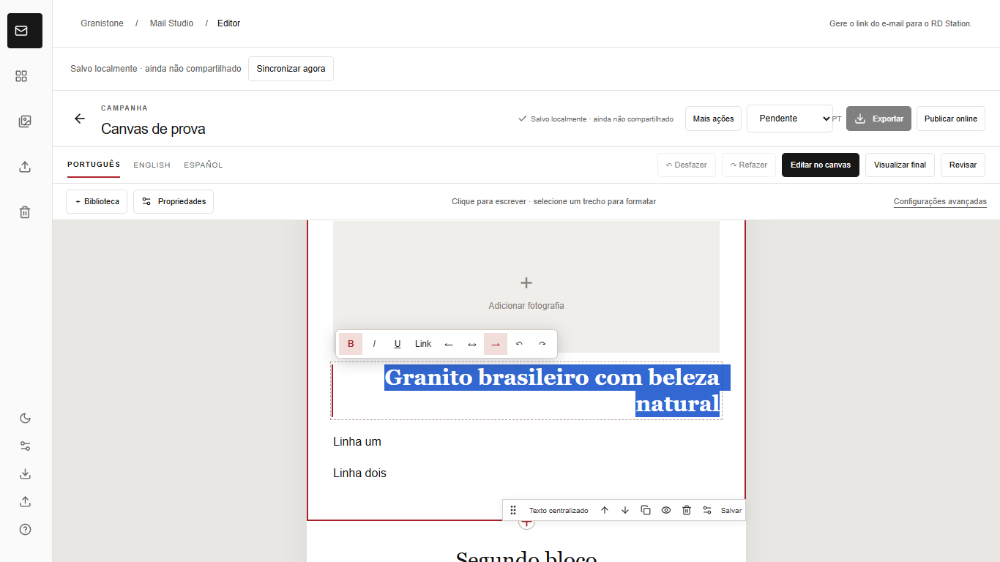
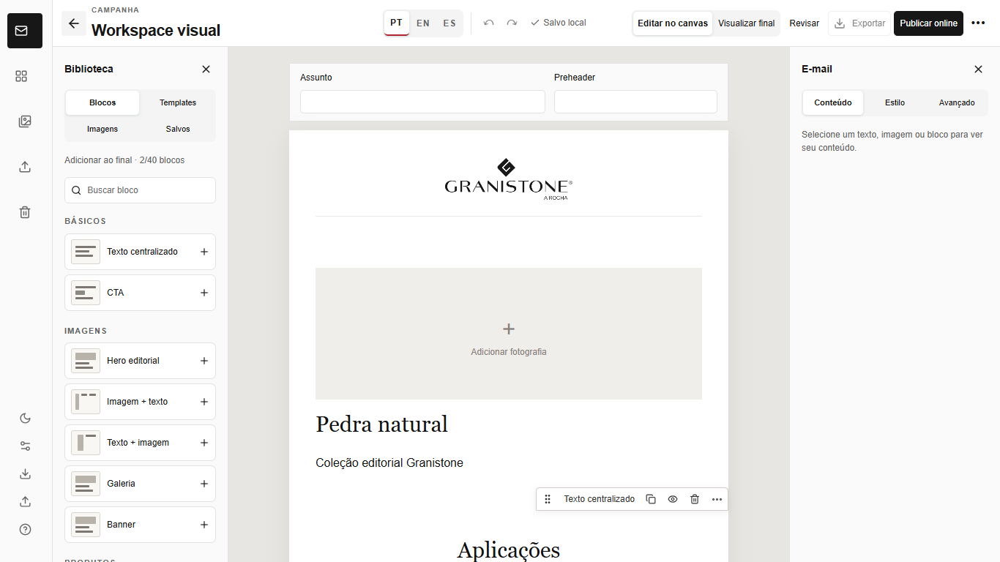
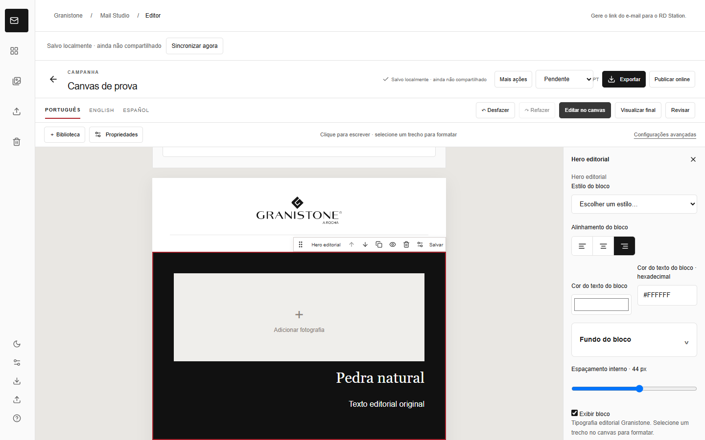
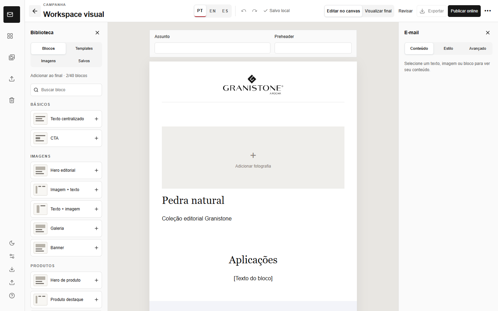
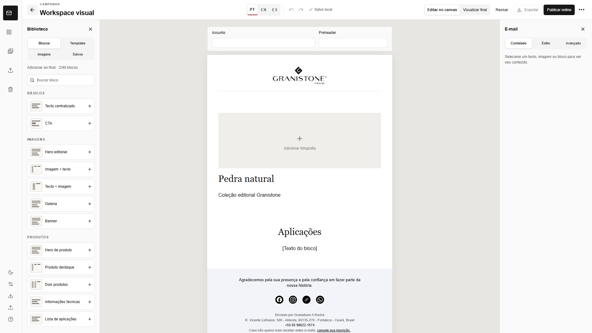

# Workspace de produção — reorganização do editor

Implementação na branch `codex/workspace-production-ux`, partindo da versão publicada do editor visual (`8239628`). Esta entrega altera a interface do aplicativo; o renderizador e o HTML final do e-mail não foram modificados. **Sem deploy em produção.**

## O que mudou

- O breadcrumb, a faixa de sincronização, o banner azul de sessão e as duas barras do editor foram reunidos em um único cabeçalho de 64 px. Nome da campanha editável, sessão, idioma, histórico local, salvamento, modos, revisão, exportação e publicação ficam agrupados por função. Histórico de versões, sincronização manual, status, duplicação, templates e configurações avançadas ficam no menu Mais.
- A sessão de edição usa o mesmo mecanismo de permissões e bloqueio colaborativo. O estado aparece ao lado do nome; iniciar e encerrar a sessão continuam disponíveis no cabeçalho. Erros e avisos que exigem ação continuam visíveis.
- A biblioteca lateral ganhou busca, seis categorias, cartões com miniaturas esquemáticas e abas Blocos, Templates, Imagens e Salvos. A seleção de imagens reutiliza a biblioteca de arquivos e materiais existente. Ações de templates continuam abrindo a configuração de estrutura da campanha, evitando troca silenciosa de um modelo já preenchido.
- O canvas conserva 600 px, rola separadamente e permanece montado ao abrir ou recolher os painéis. Assunto e preheader foram compactados lado a lado; duas barras laterais de ícones permitem abrir biblioteca e propriedades sem ocupar altura acima do e-mail.
- O inspetor organiza Conteúdo, Estilo e Avançado em três abas. Selecionar texto mantém apenas a barra flutuante, sem abrir o painel. Selecionar imagem abre Conteúdo com o seletor, upload, URL, ALT e recorte existentes. Selecionar um bloco mostra ações básicas ao passar o mouse; mover por teclado, propriedades e salvar bloco ficam em Mais opções.
- Sem seleção, o inspetor mostra apenas orientação contextual; os fundos gerais continuam acessíveis por uma ação explícita em Configurações avançadas.
- Os controles usam tamanhos e contrastes mais legíveis. Em larguras menores, os rótulos de modo encurtam e ações secundárias passam ao menu Mais, mantendo o cabeçalho em uma linha.

## Antes e depois

| Resolução | Antes | Depois |
| --- | --- | --- |
| 1366 × 768 |  |  |
| 1440 × 900 |  |  |

As capturas usam campanhas de teste diferentes, portanto comparam a organização da interface. Antes, o canvas começava aproximadamente a 300 px do topo em 1366 × 768; agora começa a 64 px. São cerca de **236 px adicionais de superfície de trabalho vertical**. A compactação de assunto e preheader também adianta o topo do e-mail para aproximadamente 178 px nesta captura. As três novas capturas mostram os dois painéis abertos e o e-mail ainda com 600 px. Há uma captura adicional do estado colaborativo em `screenshots/depois-colaboracao-1366x768.png`.

## Arquivos alterados

- `components/Studio.tsx`, `components/WorkspacePanel.tsx`, `components/WorkspacePresence.tsx`: integração visual de sincronização e sessão no cabeçalho, mantendo a lógica existente.
- `components/CampaignEditor.tsx`: barra principal única, edição do nome e agrupamento das ações.
- `components/canvas/VisualWorkspace.tsx`: biblioteca, categorias, painéis, inspetor e ações de bloco.
- `app/canvas.css`: dimensões, hierarquia, estados e adaptação do workspace.
- `tests/browser/workspace-layout.spec.ts`: verificação da estrutura, dos painéis, da edição e das resoluções.
- Testes de navegador existentes: rotas de acesso atualizadas para o menu Mais e o novo botão de sessão.

## Validação e limites

O teste automatizado mede a altura de 64 px do cabeçalho, largura de 600 px do e-mail, ausência de rolagem horizontal, rolagem independente, acesso aos painéis, digitação inline, barra flutuante, preview final e sessão compartilhada. A suíte existente continua cobrindo imagens, recorte, blocos, idiomas, sincronização, exportação e publicação local de teste.

Resultado final: `pnpm typecheck` e `pnpm lint` sem erros; `pnpm test` com 62 testes aprovados; `pnpm build` concluído; `pnpm test:browser` com 47 testes aprovados, incluindo as três resoluções de referência. `git diff --check` não apontou erros de whitespace.

O aplicativo continua desktop-first. Abaixo das larguras de referência, alguns rótulos são compactados; não foi criado um novo editor mobile. O HTML exportado mantém as regras anteriores e ainda depende de homologação em clientes de e-mail reais.
