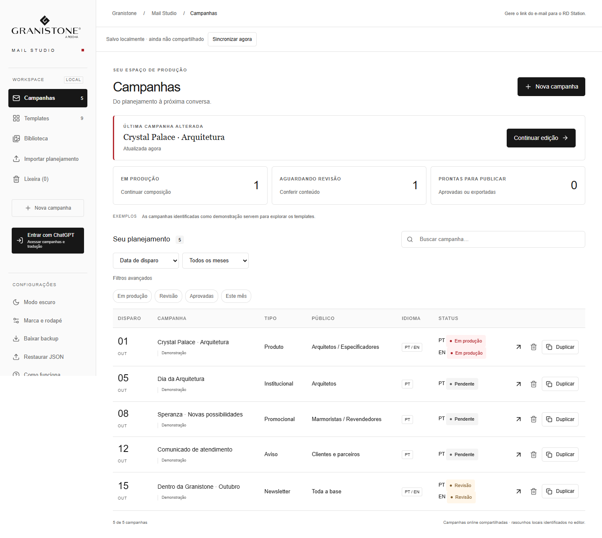
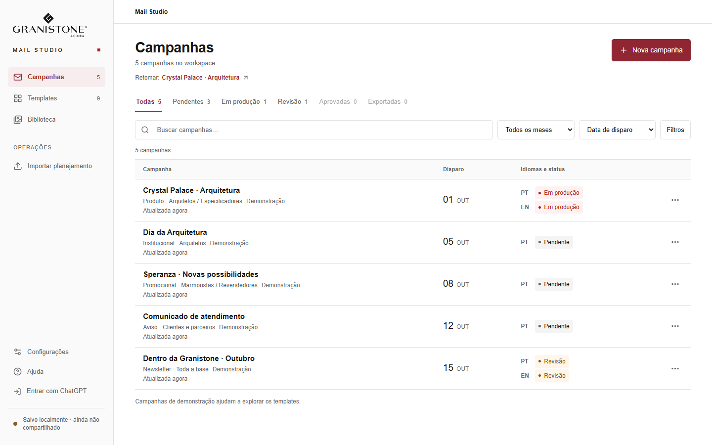

# Workspace de campanhas — comparação visual

As capturas usam os mesmos cinco exemplos locais em cada resolução. A versão anterior foi registrada a partir do commit `922afc4`; a nova versão usa a interface desta mudança.

| Antes, 1440 × 900 | Depois, 1440 × 900 |
| --- | --- |
|  |  |

A tabela passa a aparecer logo depois do cabeçalho, dos estados e da busca. Os cartões de métricas e o cartão grande de retomada saem da área principal. A sidebar mantém navegação, importação, configurações, ajuda e sincronização com menos elementos permanentes.

| Resolução | Claro | Escuro |
| --- | --- | --- |
| 1366 × 768 | [Ver captura](screenshots/campaign-workspace/after-light-1366x768.png) | [Ver captura](screenshots/campaign-workspace/after-dark-1366x768.png) |
| 1440 × 900 | [Ver captura](screenshots/campaign-workspace/after-light-1440x900.png) | [Ver captura](screenshots/campaign-workspace/after-dark-1440x900.png) |
| 1920 × 1080 | [Ver captura](screenshots/campaign-workspace/after-light-1920x1080.png) | [Ver captura](screenshots/campaign-workspace/after-dark-1920x1080.png) |

Também foram conferidos os [menus de campanha](screenshots/campaign-workspace/after-light-menu-1440x900.png), os [filtros avançados](screenshots/campaign-workspace/after-light-filters-1440x900.png) e as [configurações](screenshots/campaign-workspace/after-light-settings-1440x900.png). As capturas correspondentes do tema escuro ficam na mesma pasta.
